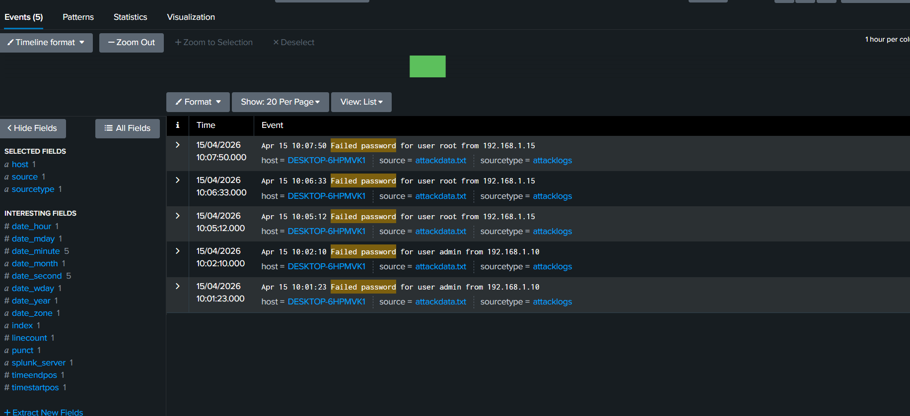
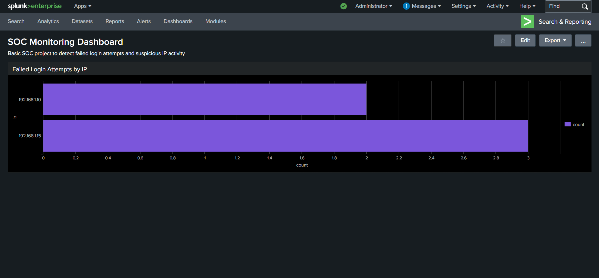

# Splunk SOC Project

## Overview

This project demonstrates a basic Security Operations Center (SOC) workflow using Splunk. It focuses on detecting failed login attempts, identifying suspicious IP activity, and visualizing security events through dashboards.

---

## Objectives

* Collect and analyze log data
* Detect failed login attempts
* Identify suspicious IP activity
* Visualize security events

---

## Tools Used

* Splunk Enterprise

---

## Steps Performed

1. Uploaded log data into Splunk
2. Searched for failed login attempts
3. Extracted attacker IP addresses
4. Analyzed repeated login failures
5. Created a dashboard for visualization

---

## Key Findings

* Multiple failed login attempts detected
* Suspicious IP identified: **192.168.1.15**
* Pattern suggests a possible brute force attack

---

## Screenshots

### 🔹 Failed Login Events

The image below shows multiple failed login attempts detected in Splunk logs, highlighting repeated authentication failures from suspicious IP addresses.

---

### 🔹 SOC Dashboard Visualization

This dashboard visualizes failed login attempts by IP, helping quickly identify the most suspicious sources.

---

## Conclusion

This project demonstrates how Splunk can be used in a SOC environment to monitor logs, detect suspicious activity, and visualize security events. It highlights the importance of log analysis in identifying potential threats such as brute force attacks.

## Future Improvements

* Implement real-time alerting for failed login attempts
* Integrate threat intelligence sources
* Expand log ingestion from multiple systems
* Automate detection and response workflows

